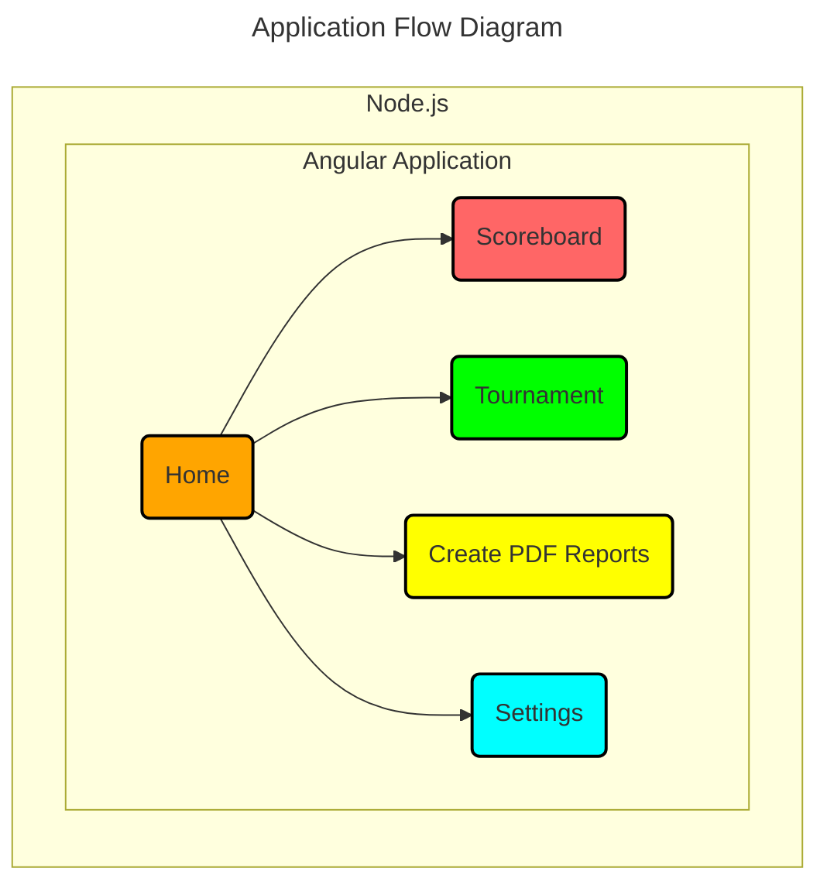
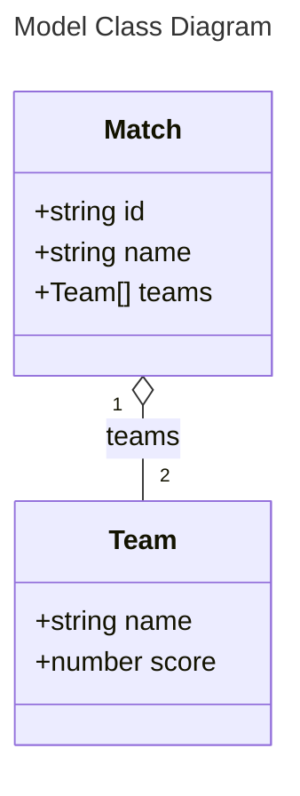
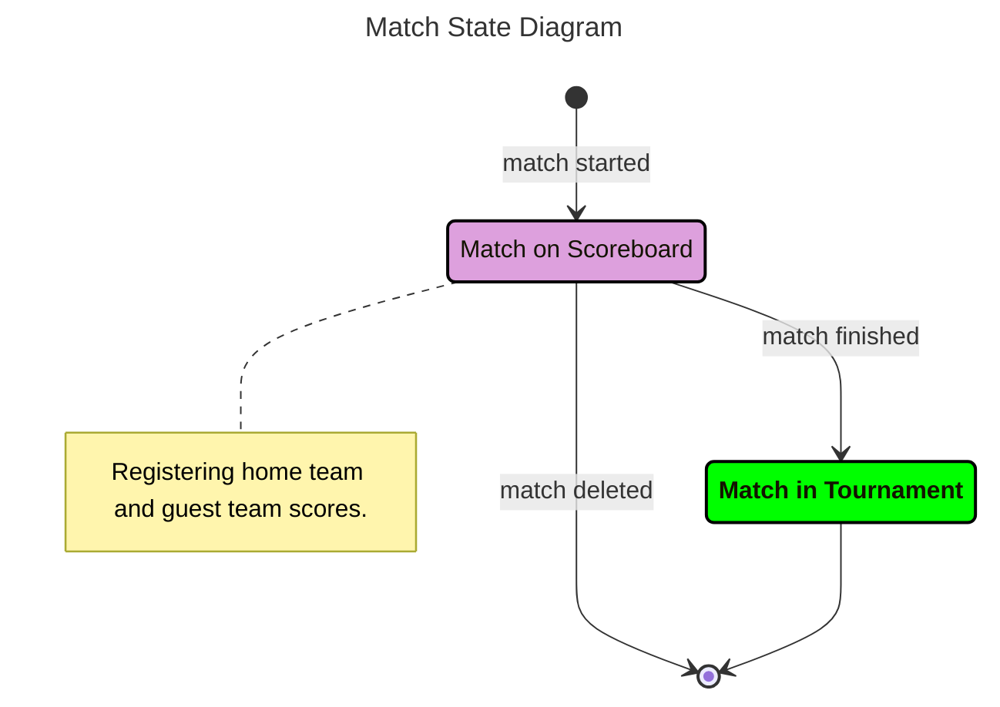

# The Recruitment Task SR1
An Angular 20+ and Angular Material application that utilizes an in-memory data store.

<table>
  <tr>
    <td rowspan="3"></td>
    <td></td>
    <td rowspan="3"></td>
  </tr>
  <tr>
    <td>
      Live demo&nbsp;&nbsp;➔&nbsp;&nbsp;
      <a href="https://ee-cs.github.io/RecruitmentTaskSR1/">Recruitment Task SR1 (GitHub Pages)</a>
    </td>
  </tr>
  <tr>
    <td></td>
  </tr>
</table>

## ❶ Architecture


---



---




---

<details>
<summary><mark>Tournament object JSON</mark></summary>

```json
{
  "tournamentMatches": [
    {
      "id": "1",
      "name": "1st Match",
      "teams": [
        {
          "name": "Mexico",
          "score": 0
        },
        {
          "name": "Canada",
          "score": 5
        }
      ]
    },
  ]
}
```

</details>

---

## ❷ Description of the Business Logic
1. **Home Page**
  - The "Home" page displays the application's logo.

2. **Scoreboard Page**
  - **Match Creation**:
    - A match is created with a home team and a guest team.
    - Names are required for the match, home team, and guest team.
  - **Gameplay**:
    - Games can be started with an initial score of 0-0.
    - Scores for both the home and guest teams can be modified.
    - Scores are color-coded for visual feedback:
      - **Winning score** 🟩
      - **Losing score** 🟥
      - **Tied score** 🟦
  - **Match Management**:
    - **Finishing a Game**:
      - An action with a confirmation dialog allows a user to finish a game.
      - The finished match is then moved from the scoreboard to the tournament and removed from the active scoreboard.
    - **Saving to Cache**: Selecting another menu item saves the current match state to the cache.
    - **Deleting a Match**: A match can be deleted via an action with a confirmation dialog.

3. **Tournament Page**
  - This page displays all finished matches transferred from the scoreboard.
  - **Sorting**: Matches are sorted first by the total score and then by the most recently completed time.

4. **Create PDF Reports Page**
  - This page generates and provides options to open, download, or print a PDF report.
  - **Tournament Report**: The report provides a summary of matches, sorted in the same manner as on the "Tournament" page.

5. **Settings Page**
  - This page allows users to load predefined datasets.
  - **Available Datasets**:
    - **Standard**: The dataset is described in the business requirements and is used for Cypress tests.
    - **Full**: Contains 144 teams in 72 matches, with team names sourced from World Cup qualified and unqualified teams.
    - **Empty**: Contains no matches or teams and is used for Cypress tests.
  - **Data Persistence**: The selected dataset is saved to local storage, overwriting any previously saved dataset.

---

## ❸ Testing
  - **Unit Tests**: Includes 40 unit tests for components and services using Jasmine.
  - **End-to-End (E2E)** Tests: Features E2E five tests using Cypress.
    - **Cypress Tests Screenshots**:
        The [Cypress tests](https://github.com/Ee-Cs/RecruitmentTaskSR1/tree/main/cypress/e2e)
        generate screenshots, available in the 
        [cypress/screenshots](https://github.com/Ee-Cs/RecruitmentTaskSR1/tree/main/cypress/screenshots) directory.
  - **Live Demo**: A [live demo](https://ee-cs.github.io/RecruitmentTaskSR1/) is available and features multiple datasets.

---

## ❹ Development
<details>
<summary>Proposed Enhancements</summary>

  - **Persistence**: Migrate from the current in-memory store to a persistent database solution to ensure data durability.
  - **Logging**: Refactor application logging to improve monitoring and diagnostics.
  - **Security**: Implement comprehensive authorization and authentication mechanisms.
  - **Monitoring**: Add event auditing and error monitoring to maintain a high-quality service level.
  - **Deployment**: Transition to nanoservices on a cloud platform to enhance scalability and resilience.
  </details>